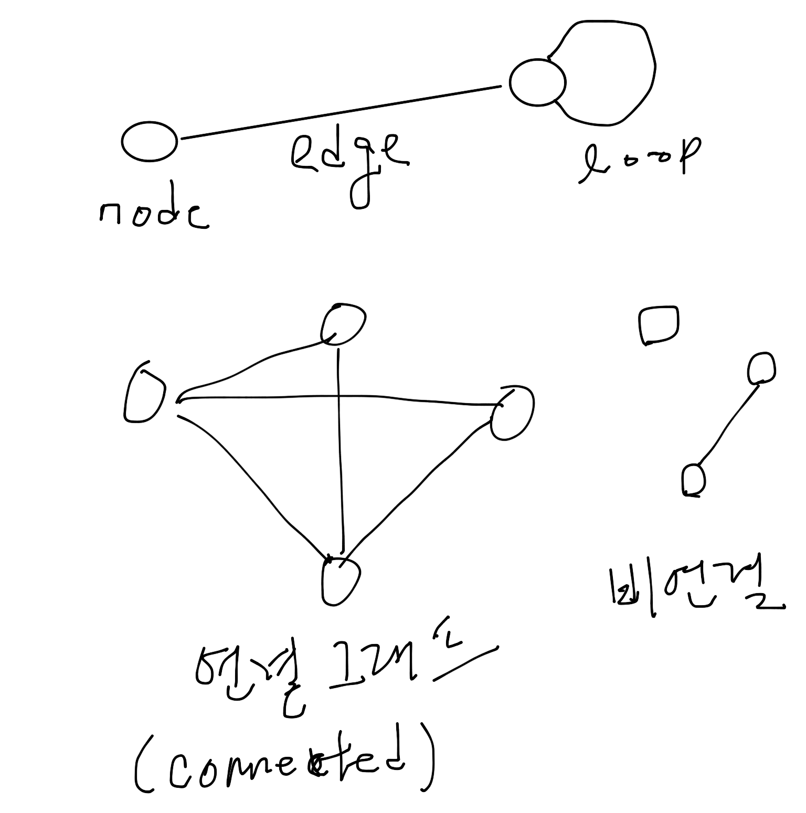
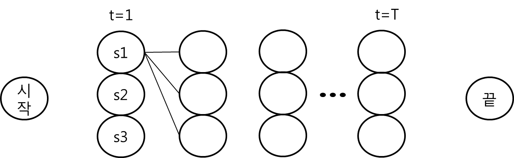

.. _Chapter5:

************************************
Chapter 5. 가중치와 최적화 프로그램
************************************

이 문서는 한빛미디어에서 나온 ``처음 배우는 인공지능`` 을 공부하면서 정리한 것이다.

.. _graph01:

01 그래프 이론
##############

그래프
******
`그래프 <https://ko.wikipedia.org/wiki/%EA%B7%B8%EB%9E%98%ED%94%84>`_ 란 점과 점을 연결하는 선으로 구성된 형태를 말합니다. 점은 정점 (Vertex) 또는 노드 (node) 라고 부르고 선은 간선 (edge)라고 부릅니다.

무향 그래프와 유향 그래프
*************************
* 무향 그래프 (undirected graph): 그래프의 간선에 방향이 없는 그래프
* 유향 그래프 (directed graph): 그래프의 간선에 방향이 있는 그래프
* 유향 순회 그래프 (directed cyclic graph): 어떤 노드에서 자신으로 돌아오는 path가 있는 그래프
* `유향 비순회 그래프 (directed acyclic graph) <https://en.wikipedia.org/wiki/Directed_acyclic_graph#Definitions>`_: cycle 이 없는 유향 그래프 (책의 설명이 좀 이상합니다. - 어떤 정점에서 출발한 후 해당 정점에 돌아오는 경로가 하나인 그래프)
* 간선 가중 그래프: 간선에 가중치가 있는 그래프 (aka network)
* 정점 가중 그래프: 정점에 가중치가 있는 그래프 (aka network)

그래프의 행렬 표현
******************
그래프를 나타내는 방법 중에서 행렬로 나타내는 방법을 소개합니다. 이 책에서는 인접행렬(adjacency matrix) 와 근접행렬(incidence matrix) 를 설명합니다.

* `인접행렬 <https://ko.wikipedia.org/wiki/%EC%9D%B8%EC%A0%91%ED%96%89%EB%A0%AC>`_: 정점 사이의 관계를 타나내는 행렬
* `근접행렬 <https://en.wikipedia.org/wiki/incidence_matrix>`_: 정점과 변의 관계를 타나내는 행렬

.. image:: imgs/chap5_2.png
	:width: 500px
	:align: center
	:height: 100px
	:alt: alternate text

`트리 구조 그래프 <https://en.wikipedia.org/wiki/Tree_structure>`_
******************************************************************
트리 구조는 그래프구조의 하나로 조상이 없는 노드를 root 노드로 두고 그 아래로 자식관계를 가지는 후손 노드들이 펼쳐지는 구조이다. 이를 통해 하나의 정점에서 다른 정점으로 가는 경로가 단 한개만 존재한다.

.. _graph02:

02 그래프 탐색과 최적화
#######################

탐색 트리 구축
**************
출발점에서 목적지까지를 노드로 정의하고 각 노드와 에지에 이익, 비용과 같은 평가 값을 저장해두고 목적지에 도달하는 최적 경로를 찾을 수 있도록 트리를 구축하는 것을 말하고자 합니다.
가장 대표적인 것이 데이터베이스의 인덱스에 사용하는 이진 탐색 트리나 미로 찾기같은 경로 탐색을 위한 트리가 있습니다.

탐색 트리 추적 방법
*******************
* 깊이 우선 탐색:

.. image:: imgs/chap5.2.1.png
	:width: 500px
	:align: center
	:height: 100px
	:alt: alternate text

* 너비 우선 탐색:

.. image:: imgs/chap5.2.2.png
	:width: 500px
	:align: center
	:height: 100px
	:alt: alternate text

효율 좋은 탐색 방법
*******************
비용이라는 개념없이 순서만 처리하는 깊이 우선 탐색이나 너비 우선 탐색에는 한계가 있기 때문에 비용이라는 개념을 바탕으로 효율을 높여야 합니다.

비용에 따른 탐색 방법
=====================
*A\* algorithm의* `wiki <https://ko.wikipedia.org/wiki/A*_%EC%95%8C%EA%B3%A0%EB%A6%AC%EC%A6%98>`_ *를 참조해서 일단 개념을 이해 하고 책 내용을 보는 것이 좋겠다.*

예를 들어 부산에서 서울로 출발할 때 동대구를 통과하느냐 경주를 통과하느냐에 따라 시간과 비용에 차이가 나는데 이런 경우 우선 비용을 정의해야 합니다. 이 책에서는 비용에 대해 다음의 세종류를 들고 있습니다.

* 초기 상태 -> 상태 :math:`s` 의 최적 경로 이동에 드는 비용의 총합 :math:`g(s)`
* 상태 :math:`s` -> 목표하는 최적 경로 이동에 드는 비용의 총합 :math:`h(s)`
* 상태 :math:`s` 를 거치는 초기 상태 -> 목표의 최적 경로 이동에 드는 비용의 총합 :math:`f(s) (= g(s)+h(s))`

:math:`\hat{g}(s)` 를 최소화 하도록 노드 선택: 최적 탐색이라고 함 (optimal search). 탐색량이 많은 단점

:math:`\hat{h}(s)` 를 최소화 하도록 노드 탐색: 최선 우선 탐색 (Best-first search). 잘못 된 결과가 나올 수 있는 단점

동적 계획법 (dynamic programming)
********************************
역자의 각주 `wiki 동적계획법 <https://ko.wikipedia.org/wiki/동적_계획법>`_ 을 참고하는 것이 이해하기가 더 쉽습니다.

동적 계획법은 모든 경로를 모두 비교하는 방법으로 복잡한 문제를 더 작은 단위의 문제로 나누어 작은 문제의 결과를 메모리를 사용하여 저장함으로써 계산량을 줄이는 기법을 말합니다.
이 책에서는 시계열 기준 상태변화의 예를 들어서 동적 프로그래밍의 효율성을 설명하고 있습니다.

시간 :math:`t=1,\dots,T` 일 때 :math:`s_t` 라는 상태 패턴이 N 개 존재하면 전체적으로 :math:`t=1` 에서 :math:`t=T` 까지 가능한 전체 경로 수가 :math:`N^T` 가 됩니다.

이렇게 모든 경로를 열거해 평가하게 되면 계산량이 :math:`O(N^T)` 가 되기 때문에 계산량을 줄이기 위해 문제를 잘게 나누어 각각의 세부 계산 결과를 메모리에 저장하여 최적해를 찾는 방법을 사용하는 것이 좋습니다.

여기서 점수 계산식은 다음과 같이 정의할 수 있습니다.

.. math::
	F_t(S_t)=\max_{s_{t-1}}[F_{t-1}(s_{t-1})+h_t(s_{t-1},s_t)]

즉 :math:`t` 시간에서의 최대값은 :math:`t-1` 시간까지의 최대값에 :math:`t-1` 과 :math:`t` 사이에서의 최대값만 고려하여 계산하면 됩니다. Bioinformatics 쪽에서는 `Needleman-Wunsch algorithm <https://en.wikipedia.org/wiki/Needleman%E2%80%93Wunsch_algorithm>`_ 나 `Smith-Waterman algorithm <https://en.wikipedia.org/wiki/Smith%E2%80%93Waterman_algorithm>`_ 이 대표적인 예가 되겠습니다.

03 유전 알고리즘
###############

유전 알고리즘 구조
*****************
아래 영상이 전반적인 개념을 이해하는데 도움을 주네요

`Youtube Video <https://www.youtube.com/watch?v=zwYV11a__HQ>`_
이정도 하고 넘어가면 될 듯 합니다.

04 신경망
#########

헵의 법칙과 형식 뉴런
********************
생명체의 신경세포가 외부 자극을 받을 때 신호의 세기가 일정 기준을 넘으면 다음 신경 세포로 신호를 전달하는 것을 수학적 모델로 삼아서 만든 개념입니다. 이 수학 모델을 맥컬록-피츠 (McCulloch-Pitts) 모델이라고 합니다.
헵의 법칙은 시냅스의 가소성을 처음 제창한 사람의 이름인 도널드 헵의 이름을 따서 붙은 법칙으로 시냅스의 연결이 상호작용에 의해 강화되고 약해지는 것을 나타냅니다. 이를 신경망에서는 가중치가 변하는 것으로 모델링을 합니다.

신경망
******
형식 뉴런을 여러개 이어서 수학적인 신경회로를 구성한 것입니다.

활성화함수
*********
형식 뉴런에서 받은 입력값을 출력할 때 일정 기준에 따라 출력값을 변화시키는 비선형 함수가 활성화 함수입니다. 이 책에서는 단위 계단 함수, 시그모이드 함수, 계단 함수, :math:`\tanh(x)` 를 소개하고 있습니다.

퍼셉트론
********
입력 계층 (input layer), 출력 계층 (output layer) 로 구성이 되며 입력과 출력 사이에 은닉 계층 (hidden layer) 가 존재한다. 각 노드는 이 전 계층 (layer) 의 출력을 입력으로 받으며 연결된 edge 에 가중치 (weight) 가 있어 이들의 곱의 합을 바탕으로 활성화 함수에 의해 0과 1로 출력값을 결정한다. 퍼셉트론의 특징은 학습이 가능하다는 것으로 출력 계층의 결과치를 정답과 비교하여 맞고 틀린가에 따라 가중치를 갱신하며 정답을 찾아간다. XOR 문제에 대한 해답을 다층 퍼셉트론으로 풀 수 있음을
보였다.

볼츠만머신
**********
퍼셉트론과는 달리 노드 사이에 피드백 메커니즘이 존재하는 신경망을 말합니다. 볼츠만머신은 `호필드 네트워크 <https://en.wikipedia.org/wiki/Hopfield_network>`_ 에 통계 개념을 더한 것으로 설명되나봅니다. 호필트 네트워크는 인간의 기억이라는 것을 모델링한 것이라고 합니다. 내용이 어려워서 일단 지나가겠습니다.
차후 딥러닝의 제한볼츠만머신이 나올때까지 업데이트 하겠습니다.

호필드 네트워크
===============
사람의 경우 흐릿한 예사진만 보고도 친구의 얼굴을 찾아내는 것이 가능한데 이런 것을 associative memory 라고 부릅니다. 이를 신경망을 통해 구현하고자 한 것이 호필드 네트워크입니다. n 개의 노드로 구성된 네트워크는 대략 0.15n 개의 패턴을 기억할 수 있다고 알려져 있습니다. 전체적인 단계는 storing 과 classification step 으로 구성됩니다.
input 이 들어오게 되면 storing 단계에서 생성된 패턴중에서 가장 유사한 패턴을 값으로 돌려주게 됩니다.

.. 문법참조: https://thomas-cokelaer.info/tutorials/sphinx/rest_syntax.html#restructured-text-rest-and-sphinx-cheatsheet
