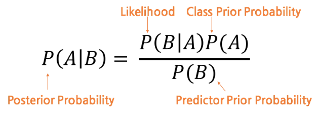
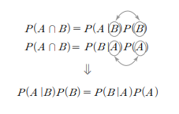
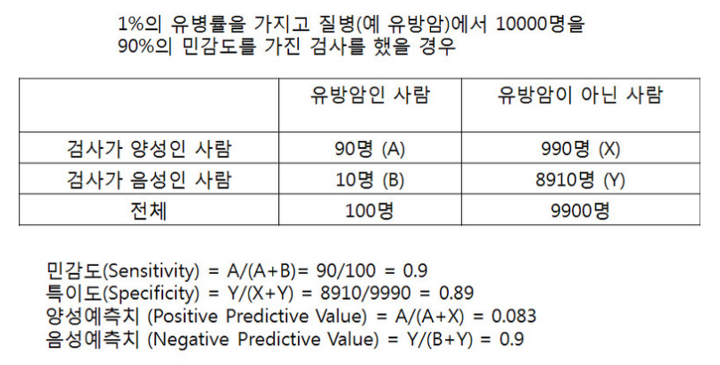
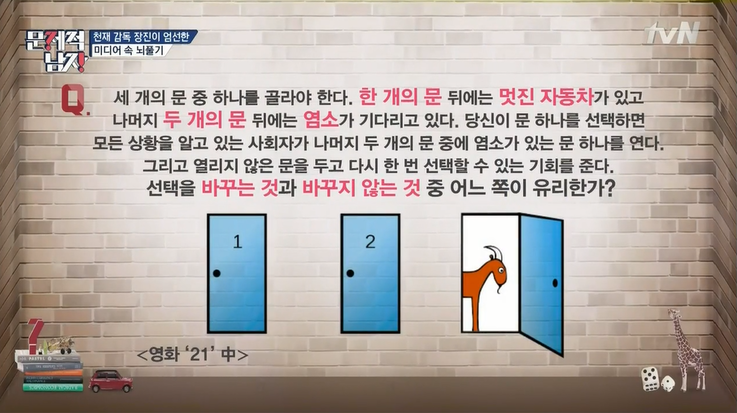
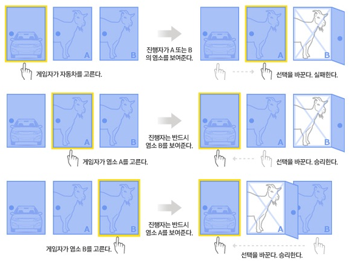
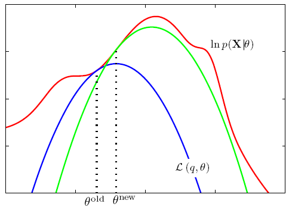
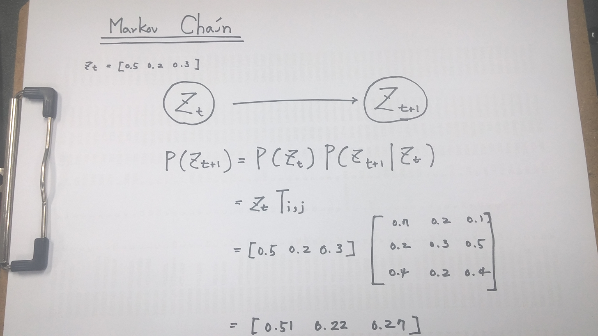
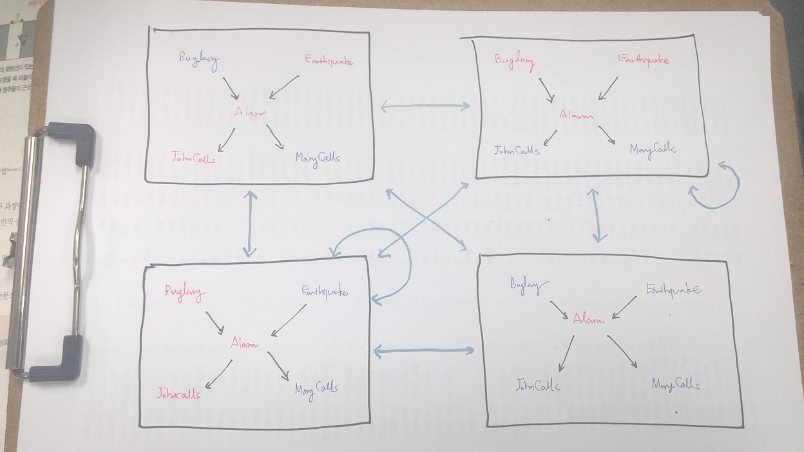
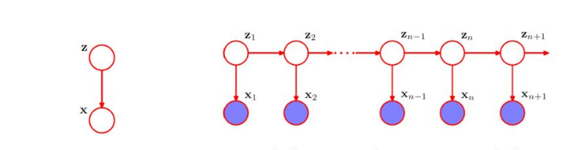

.. _Chapter6:

***************************
Chapter 6. 통계 기반 머신러닝 1 - 확률분포와 모델링
***************************

이 문서는 한빛미디어에서 나온 ``처음 배우는 인공지능`` 을 공부하면서 정리한 것이다.

01 통계 모델과 확률분포
######################

확률기반
********

`확률분포 <https://ko.wikipedia.org/wiki/%ED%99%95%EB%A5%A0%EB%B6%84%ED%8F%AC>`_ 란 확률변수가 특정한 값을 가질 확률을 나타내는 함수를 의미합니다.

* 연속 확률분포 : 확률 밀도 함수를 이용해 표현할 수 있는 확률분포를 의미합니다. 정규분포, 연속균등분포, 카이제곱분포 등이 있습니다.

* 이산 확률분포 : 이산 확률변수가 가지는 확률분포를 의미합니다. 이산균등분포, 푸아송분포, 베르누이분포, 기하분포,초기하분포,이항분포 등이 있습니다.

머신러닝
********

머신러닝이란 "기계가 학습한다"는 개념을 의미하는 용어로, 입력 데이터의 특성과 분포, 경향 등에서 자동으로 데이터를 나누거나 재구성 하는 것을 의미합니다.

* 지도학습(Supervised Learning) : 데이터에 정답 정보가 결합된 학습 데이터(또는 훈련 데이터)로 데이터의 특징을 모델링하는 과정을 의미합니다. 주로 식별과 예측 등을 목적으로 둘 때가 많으므로 데이터를 선형 결합으로 나타내려는 특성을 이용합니다.

* 자율학습(Unsupervised Learning) : 입력 데이터의 정답을 모르는 상태에서 사용하는 것으로 클러스터 분석, 차원압축, 밀도추정 등이 해당합니다.

.. image:: imgs/머신러닝_types.png
        :width: 500px
        :align: center
        :height: 500px
        :alt: alternate text

기저함수
********

`기저함수 <https://ko.wikipedia.org/wiki/%EA%B8%B0%EC%A0%80_%ED%95%A8%EC%88%98>`_ 란 서로 직교하면서 선형적으로 독립적인 함수의 집합을 의미합니다. 기저함수를 구성하는 설명 변수(기저벡터)들은 선형 독립이어야 합니다.

주요 기저함수
*************

기저함수는 확률분포 모델에 따라 연속 확률분포와 이산 확률분포로 분류됩니다.

1. 연속 확률분포

* 정규분포

`정규분포 <https://ko.wikipedia.org/wiki/%EC%A0%95%EA%B7%9C%EB%B6%84%ED%8F%AC>`_ 는 가장 많이 사용하는 분포 개념으로 가우스 분포(Gaussian distribution)라고도 합니다. 실험의 측정 오차나 사회 현상 등 자연계의 현상은 정규분포를 따르는 경향이 있습니다.

.. image:: imgs/정규분포_식.png
        :width: 500px
        :align: center
        :height: 500px
        :alt: alternate text
        
.. image:: imgs/정규분포_그래프.png
        :width: 500px
        :align: center
        :height: 500px
        :alt: alternate text

* 감마분포

`감마분포 <https://ko.wikipedia.org/wiki/%EA%B0%90%EB%A7%88_%EB%B6%84%ED%8F%AC>`_ 는 특정 수의 사건이 일어날 때까지 걸리는 시간에 관한 연속 확률분포 입니다. 모양 매개변수가 k이고 크기 매개변수가 θ일 때, 평균은 kθ, 분산은 kθ^2입니다. k=1 일 때 지수분포, k가 반정수((2n-1)/2)고 θ=2 일 때 카이제곱 분포라고 합니다.

.. image:: imgs/감마분포_식.png
        :width: 500px
        :align: center
        :height: 500px
        :alt: alternate text
        
.. image:: imgs/감마분포_그래프.png
        :width: 500px
        :align: center
        :height: 500px
        :alt: alternate text

* 지수분포

`지수분포 <https://ko.wikipedia.org/wiki/%EC%A7%80%EC%88%98%EB%B6%84%ED%8F%AC>`_ 는 감마분포의 모양 매개변수 k=1 일 때 사건이 일어나는 시간 간격의 확률분포를 의미합니다. 푸아송 분포와도 깊은 연관이 있습니다. 

.. image:: imgs/지수분포_식.png
        :width: 500px
        :align: center
        :height: 500px
        :alt: alternate text
        
.. image:: imgs/지수분포_그래프.png
        :width: 500px
        :align: center
        :height: 500px
        :alt: alternate text

* 베타분포

`베타분포 <https://ko.wikipedia.org/wiki/%EB%B2%A0%ED%83%80_%EB%B6%84%ED%8F%AC>`_ 는 2개의 변수를 갖는 특수 함수인 베타함수를 이용한 분포입니다. 매개변수 a, b를 바꾸면 다양한 분포를 나타낼 수 있으므로 베이즈 통계학에서는 사전분포 모델로 이용할 때가 많습니다.

.. image:: imgs/베타분포_식.png
        :width: 500px
        :align: center
        :height: 500px
        :alt: alternate text
        
.. image:: imgs/베타분포_그래프.png
        :width: 500px
        :align: center
        :height: 500px
        :alt: alternate text
        
        
* 디리클레 분포

`디리클레 분포(Dirichlet distribution) <https://ko.wikipedia.org/wiki/%EB%94%94%EB%A6%AC%ED%81%B4%EB%A0%88_%EB%B6%84%ED%8F%AC>`_ 는 베타분포를 다변량으로 확장한 것으로 다변량 베타분포라고도 합니다. 연속함수지만 2차원 평면에서는 연속함수로 나타낼 수 없습니다. 확률자체를 확률분포로 두는 분포로 자연어 처리 등에 많이 사용합니다.

.. image:: imgs/디리클레분포_식.png
        :width: 500px
        :align: center
        :height: 500px
        :alt: alternate text
        
.. image:: imgs/디리클레분포_그래프.png
        :width: 500px
        :align: center
        :height: 500px
        :alt: alternate text

2. 이산 확률분포

* 이항분포

`이항분포 <https://ko.wikipedia.org/wiki/%EC%9D%B4%ED%95%AD_%EB%B6%84%ED%8F%AC>`_ 란 베르누이 시행(두 가지 종류 중 어느 하나가 나오는가와 같은 실험)을 여러 번 시행했을 때 확률분포를 의미합니다. 정규분포나 포아송분포와 비슷합니다.

.. image:: imgs/이항분포_식.png
        :width: 500px
        :align: center
        :height: 500px
        :alt: alternate text
        
.. image:: imgs/이항분포_그래프.png
        :width: 500px
        :align: center
        :height: 500px
        :alt: alternate text

* 음이항분포

`음이항분포 <https://en.wikipedia.org/wiki/Negative_binomial_distribution>`_ 란 r번 성공하는데 필요한 시행횟수 k의 분포를 의미합니다. 생명과학 분야에서 많이 사용합니다.

.. image:: imgs/음이항분포_식.png
        :width: 500px
        :align: center
        :height: 500px
        :alt: alternate text
        
.. image:: imgs/음이항분포_그래프.png
        :width: 500px
        :align: center
        :height: 500px
        :alt: alternate text

* 푸아송분포

`푸아송분포 <https://ko.wikipedia.org/wiki/%ED%91%B8%EC%95%84%EC%86%A1_%EB%B6%84%ED%8F%AC>`_ 란 일정 시간 간격에 걸쳐 평균 λ번 일어나는 현상이 k번 발생할 확률분포를 의미합니다. 지수분포가 사건이 일어난 후 다시 발생할 때까지의 시간 간격에 대한 확률밀도를 나타내는 반면, 푸아송분포는 단위 시간에 사건이 일어날 확률을 나타내므로 이 둘은 같은 사건의 발생 확률을 다른 측면에서 본다고 이해할 수 있습니다.

.. image:: imgs/푸아송분포_식.png
        :width: 500px
        :align: center
        :height: 500px
        :alt: alternate text
        
.. image:: imgs/푸아송분포_그래프.png
        :width: 500px
        :align: center
        :height: 500px
        :alt: alternate text

* 카이제곱분포
`카이제곱분포 <https://ko.wikipedia.org/wiki/%EC%B9%B4%EC%9D%B4%EC%A0%9C%EA%B3%B1_%EB%B6%84%ED%8F%AC>`_ 란 집단을 몇 가지로 나눴을 때 크기가 작은 집단에 보편성이 있는지 확인할 수 있는 분포입니다. 통계적 추론에서는 카이제곱 검정(독립성 검정)으로 자주 이용하며, 임상시험이나 사회과학 설문조사 등에 자주 사용합니다.

.. image:: imgs/카이제곱분포_식.png
        :width: 500px
        :align: center
        :height: 500px
        :alt: alternate text
        
.. image:: imgs/카이제곱분포_그래프.png
        :width: 500px
        :align: center
        :height: 500px
        :alt: alternate text

* 초기하분포
`초기하분포 <https://en.wikipedia.org/wiki/Hypergeometric_distribution>`_ 란 반복하지 않는 시도에서 사건이 발생할 확률분포를 의미합니다.

.. image:: imgs/초기하분포_식.png
        :width: 500px
        :align: center
        :height: 500px
        :alt: alternate text
        
.. image:: imgs/초기하분포_그래프.png
        :width: 500px
        :align: center
        :height: 500px
        :alt: alternate text
      
      
* 로지스틱분포
`로지스틱분포 <https://en.wikipedia.org/wiki/Logistic_distribution>`_ 란 확률분포의 확률변수가 특정 값보다 작거나 같은 확률을 나타내는 누적분포 함수가 로지스틱 함수인 분포를 의미합니다. 정규분포와 비슷하지만 그래프의 아래가 길어 평균에서 멀어지더라도 정규분포처럼 곡선이 내려가지 않습니다.

.. image:: imgs/로지스틱분포_식.png
        :width: 500px
        :align: center
        :height: 500px
        :alt: alternate text
        
.. image:: imgs/로지스틱분포_그래프.png
        :width: 500px
        :align: center
        :height: 500px
        :alt: alternate text
        

* 확률분포 정리

.. image:: imgs/분포정리_그림.png
        :width: 500px
        :align: center
        :height: 500px
        :alt: alternate text
        

손실함수와 경사 하강법
*********************

* 손실함수
생성된 모델을 통해 도출한 결과 값과 기대하던 값 사이 오차를 계산하는 함수입니다. 이 오차를 제곱한 값의 합계가 최솟값이 되도록 구하는 과정은 경사 하강법을 사용합니다.

1. 경사 하강법(Gradient descent method)

`경사 하강법 <https://ko.wikipedia.org/wiki/%EA%B2%BD%EC%82%AC_%ED%95%98%EA%B0%95%EB%B2%95>`_ 은 손실함수 위 한 점 w1에서 편미분 한 결과(기울기)가 0이 될 때까지 w의 위치에 변화를 주면서 손실 함수의 최솟값을 찾아 나가는 방법입니다. 경사 혹은 기울기는 x-y 평면에서 두 변수의 관계를 설명해 줍니다. 우리는 신경망의 오차와 각 계수의 관계에 관심이 있습니다. 즉, 각 계수의 값을 증가 혹은 감소시켰을 때 신경망의 오차가 어떻게 변화하는지 그 관계에 주목합니다. 모델의 학습은 모델의 계수를 업데이트해서 오차를 줄여나가는 과정입니다.

.. image:: imgs/경사하강법_그래프.png
        :width: 500px
        :align: center
        :height: 500px
        :alt: alternate text

02 베이즈 통계학과 베이즈 추론
############################
베이즈 정리
**********

* 베이즈정리
`베이즈정리 <https://ko.wikipedia.org/wiki/%EB%B2%A0%EC%9D%B4%EC%A6%88_%EC%A0%95%EB%A6%AC>`_ 는 두 종류의 조건부 확률 사이의 관계를 정의합니다.
일반적인 베이즈정리 식입니다. 사후확률(Posterior probability)은 사전확률(Prior probability)과 우도(likelihood)의 곱과 같습니다.

        :width: 500px
        :align: center
        :height: 500px
        :alt: alternate text

* 베이즈정리 용어
1. 사전확률 (Prior Probability)
 관측자가 이미 알고있는 사건으로부터 나온 확률. P(A), P(B)
 
2. 우도 (Likelihood Probability)
 이미 알고있는 사건이 발생했다는 조건하에 다른 사건이 발생할 확률. P(B|A)
 
3. 사후확률 (Posterior Probability)
 사전확률과 우도를 통해서 알게되는 조건부 확률. P(A|B)

        :width: 500px
        :align: center
        :height: 500px
        :alt: alternate text

* 베이즈정리 예제

1. 유방암 검사

 A씨가 유방암 검사결과 양성으로 판정받았습니다. (유방암 검사의 정확도는 90%) 과연 A씨가 유방암에 걸린 것으로 나올 확률은 몇 %일까요?

        :width: 500px
        :align: center
        :height: 500px
        :alt: alternate text
        
A씨는 '양성반응일 때 유방암에 걸릴 확률'을 구하는 것입니다.

즉, 양성반응이라는 전제하에 유방암에 걸릴 확률 P(유방암|양성반응)은,

P(유방암|양성반응) = P(양성반응|유방암) * P(유방암) / P(양성반응)

P(양성반응|유방암) = 0.9

P(유방암) = 0.01

p(양성반응) = 유방암일 때 양성반응일 확률 + 유방암이 아닐 때 양성반응일 확률

= 0.9 * 0.01 + 0.1 * 0.99

= 0.108

따라서 P(유방암|양성반응) = 0.9 * 0.01 / 0.108 = 0.083

유방암 검사에서 양성반응일 경우 유방암일 확률은 약 8.3% 입니다.

2. 몬티홀 문제

        :width: 500px
        :align: center
        :height: 500px
        :alt: alternate text

B씨가 1번 문을 선택한 경우 '진행자가 3번문을 열었을 때 자동차가 1번 문에 있을 확률'과 '진행자가 3번문을 열었을 때 자동차가 2번 문에 있을 확률'을 구하여 비교하는 것 입니다.

P(자동차1번|선택3번) = P(선택3번|자동차1번) * P(자동차1번) / P(선택3번)

P(선택3번|자동차1번) = 1/2

P(자동차1번) = 1/3

P(선택3번) = 1/2

따라서 P(자동차1번|선택3번) = (1/2 * 1/3) / 1/2 = 1/3

P(자동차2번|선택3번) = P(선택3번|자동차2번) * P(자동차1번) / P(선택2번)

P(선택3번|자동차2번) = 1

P(자동차2번) = 1/3

P(선택3번) = 1/2

따라서 P(자동차2번|선택3번) = (1 * 1/3) / 1/2 = 2/3

B씨는 선택을 바꾸는 것이 확률적으로 유리합니다.

        :width: 500px
        :align: center
        :height: 500px
        :alt: alternate text

최대가능도 방법과 EM 알고리즘
***************************

* 최대가능도 방법
관측데이터에서 의미있는 값을 구할 때 손실함수를 생성한 뒤 `가능도함수 <https://en.wikipedia.org/wiki/Likelihood_function>`_ 를 생성할 수 있습니다. 가능도함수가 최대가 되는 θ값을 정했을 때 θ는 최대가능도 추정량(Maximum Likelihood Estimation, MLE)라고 합니다. 엔트로피가 높은 상태, 즉 노이즈가 가장 균형있게 흩어져 있는 상태를 최대가능도 추정량으로 정해서 의미있는 데이터를 구할 수도 있습니다. 복잡한 가능도함수에서는 최대가능도 추정량을 직접 구할 수 없을 때가 많으며 보통 반복 계산으로 구하는 방법을 선택합니다.

* EM 알고리즘
`EM 알고리즘 <https://ko.wikipedia.org/wiki/%EA%B8%B0%EB%8C%93%EA%B0%92_%EC%B5%9C%EB%8C%80%ED%99%94_%EC%95%8C%EA%B3%A0%EB%A6%AC%EC%A6%98>`_ 은 숨겨진 변수를 포함하는 모델에 사용하는 가상 데이터 전체의 가능도함수를 바탕으로 불완전한 데이터에서 최대가능도 추정량을 구하는 방법을 의미합니다. Expectation 단계와 maximization 단계로 구성됩니다.

1. E (Expectation) Step
 아래쪽 경계를 결정하기 위한 θ에 의존하는 볼록함수 Q를 결정하는 단계.
2. M (Maximization) Step
 반복실행하여 Q에서의 θ를 극대화하는 단계.

max p(X|θ) = ∑ p(X,Z|θ)

lnp(X|θ) = L(q,θ)+ KL(q∥p)

L(q,θ) = ∑ q(Z) ln(p(X,Z|θ)/q(Z)) and KL(q∥p) = −∑ q(Z)ln(p(Z|X,θ)/q(Z))

각 curve는 θ값이 고정되어 있을 때, q(Z)에 대한 lower bound L(q,θ)의 값을 의미합니다. E step을 반복할 때마다 고정된 θ에 대해 p(Z)를 풀게 되는데, 이는 곧 log-likelihood와 curve의 접점을 찾는 과정과 같습니다. 또한 M step에서는 θ값 자체를 현재값보다 더 좋은 지점으로 update시켜서 curve 자체를 이동시키는 것 입니다. 이런 과정을 반복하면 알고리즘은 언젠가 local optimum으로 수렴하게 됩니다.

        :width: 500px
        :align: center
        :height: 500px
        :alt: alternate text

베이즈 추론
**********

베이즈 추론은 관측하지 않은 데이터를 다루며, 추론해야 하는 대상이 매개변수 θ일 때 확률밀도함수 Φ(θ)를 사전분포 혹은 주관분포라고 합니다. 이 식이 중요한 이유는 관측할 수 있는 데이터 이외에도 데이터에 대한 적절한 가정이 있다면 관측한 데이터만을 사용한 것보다 더 우수한 parameter estimation이 가능하기 때문입니다. 사후분포의 특징을 정하는 매개변수로는 베이즈 추정량, 사후 메디안 추정량, 최대 사후확률(MAP) 추정량의 세 가지가 있습니다.

p(Y|X) = p(X|Y)p(Y) / p(X)

1. 베이즈 추정량
 사후분포의 평균제곱오차를 최소화하는 값을 `베이즈 추정 <https://ko.wikipedia.org/wiki/%EB%B2%A0%EC%9D%B4%EC%A6%88_%EC%B6%94%EC%A0%95%EB%9F%89>`_ 이라고 합니다.
 
2. 사후 메디안 추정량
 사후분포의 평균 절대 오차를 최소화하는 값으로 사후분포의 중간값입니다.

3. MAP 추정량
 사후밀도를 최대화하는 θ값으로 사후 최빈량 추정량이라고도 합니다.

베이즈 판별분석
***************

판별분석은 데이터 x가 어떤 모집단분포에서 유래했는지 파악하는데 사용하며, 여기에 베이즈 통계학 개념이 포함된 요소를 추가한 것이 베이즈 판별분석 입니다.

N가지 종류의 데이터 x와 추론 대상 매개변수 i가 있는 모집단분포 f(x|i)와 사전분포 Φ(i)로부터 사후확률이 최대가 되는 모집단 분포의 유래를 판별합니다.

03 마르코프 연쇄 몬테카를로 방법
##############################

원주율의 근삿값 계산 문제
***********************

베이즈 추론을 실행하려고 구축한 모델은 여러 번 계산을 반복하는 것이 중요하나, '분포'를 구하는 현대 베이즈 추론에서는 분석할 수 없는 함수를 대상으로도 예측과 최적화 작업을 실행해야 하므로 실행횟수를 대폭 늘려줘야 합니다. 실행횟수를 늘려야 할 때는 조금씩 다른 매개변수를 무작위로 샘플링할 수 있어야합니다.

* 뷔퐁의 바늘 (L'aiguille de Buffon)
`뷔퐁의 바늘 <https://ko.wikipedia.org/wiki/%EB%B7%94%ED%90%81%EC%9D%98_%EB%B0%94%EB%8A%98>`_ 에 대한 설명은 `다음 페이지 <http://j1w2k3.tistory.com/756>`_ 에서 쉽게 설명하고 있습니다. 또한 `다음 페이지 <https://www.geogebra.org/m/j2fYwDR8>`_ 에서 직접 시행해 볼 수 있습니다.

몬테카를로 방법
**************

몬테카를로 방법은 난수를 이용하여 함수의 값을 확률적으로 계산하는 알고리즘으로 수학이나 물리학에서 자주 사용됩니다. 스타니스와프 울람이 모나코의 유명한 도박의 도시 몬테카를로의 이름을 본 따 명명했습니다.

        :width: 500px
        :align: center
        :height: 500px
        :alt: alternate text

* 마르코프 연쇄(Markov Chain) 

        :width: 500px
        :align: center
        :height: 500px
        :alt: alternate text

 * **Z** t로부터 **Z** t+1로 transition 진행은 transition matrix **T** i,j에 의해 일어납니다.
 
 * 각 node(Z)는 각각의 probability distribution을 가지고 있습니다. (Stochastic observation의 경우 **Z** t의 확률형태로 표현)
 
 * P(**Z** t+1)은 P(**Z** t)와 P(**Z** t+1|**Z** t)로 구할 수 있습니다.
 
 * 아주 많은 chain으로 상태전이가 계속될 때 반복 계산하여 P(**Z** t+1)을 계산할 수 있습니다.
 
 * Markov chain의 특수한 형태인 Stationary Distribution 메트로폴리스-헤이스팅스 알고리즘을 작동하도록 만드는 핵심조건 입니다.
 
 * Stationary Distribution은 π(모든 state마다 정의되는 확률분포 값)가 t에 따라 더이상 변화하지 않는 상태입니다. (πT = π)
 
 
* Traditional Markov Chain Analysis

 * Given P(**Z** t+1 | **Z** t) (=Transition Rule)...
 
 * Find π(Z) (=Stationary distribution)

* Markov Chain Monte Carlo(MCMC)

 * Given π(Z)...
 
 * Find prescribtion for an efficient transition rule to reach the stationary distribution
 
 * How to? 우리가 알고있는 π(Z)를 잘 표현할 수 있는 transition matrix를 만들어서 sampling을 반복적으로 진행합니다.
 
 * MaryCalls, Alarm이 Evidence node라고 가정할 때, 나머지 node들에 random 값을 assign해야합니다. 이 때 상태 **Z** t에서 MCMC로 계산된 transition rule을 사용하여 상태 **Z** t+1로 변화시켜보고 각 노드들의 assign 된 값을 확인합니다. 결국 가장 많이 나오는 값(most likely value)을 알지 못하던 latent variable에 assign 할 수 있습니다.
 

        :width: 500px
        :align: center
        :height: 500px
        :alt: alternate text

* Matropolis-Hastings 알고리즘

 * π(Z)를 잘 표현할 수 있는 transition matrix를 만드는 핵심 알고리즘입니다.
 * Current value **Z** t가 있을 때, candidate **Z** * ~ q(**Z** *| **Z** t)를 propose합니다.
 * 다음 acceptance probability(α)에 따라 **Z** *(accept) 혹은 **Z** t(reject)를 취합니다.

04 은닉 마르코프 모델과 베이즈 네트워크
#####################################

은닉 마르코프 모델
*****************

* 은닉 마르코프 모델 (HMM, Hidden Markov Model, Dynamic Clustering)

 * Indepentent한 data(latent variables)들로부터 시간 경과에 따라 앞/뒤 상태에 영향을 주는 모델을 의미합니다. Latent random variable인 z1은 t1에서 x1이 관찰됩니다. 또한 z1은 이후 latent random variable인 z2에 영향을 미칩니다. 여기에서 x1은 P(x1|z1)으로 표현할 수 있습니다.
 

        :width: 500px
        :align: center
        :height: 500px
        :alt: alternate text

* HMM의 main questions

 * Evaluation question
 
  * Given π, a, b, X...
  * Find P(X|M, π, a, b) : Trained model M에서 X 가능성은 어느 정도입니까?
 
 * Decoding question
 
  * Given π, a, b, X...
  * Find **argmax** z P(Z|X, M, π, a, b) : 가장 가능성이 높은(최적의) Z(latent state)는 무엇입니까?
  * 이미 π, a, b가 주어진 상황에서 Z를 구한다는 점에서 'supervisez learning'과 유사합니다.
  * 모델의 최적(최대확률을 가진) 상태를 구하는 Viterbi 알고리즘이 있습니다.

 * Learning question
 
  * Given X...
  * Find **argmax** π,a,b P(X|M, π, a, b) : X(observation)만 주어진 상황에서 HMM의 underlying parameters(π, a, b)는 무엇이 있습니까?
  * π, a, b가 알려지지 않은 상황에서 이를 추정한다는 점에서 'unsupervised learning'과 유사합니다.
  * Baum-Welch 알고리즘(EM algorithm for HMM, Forward-Backward algorithm)이 있습니다.
  
   * Optimized π, a, b (예측값)을 구합니다. 이 때 EM 알고리즘(Expectation-Maximization)을 사용합니다.
   * X, Optimized π, a, b로부터 가장 가능성이 높은(최적의) Z를 구합니다. (Decoding)
   
 
  
베이즈 네트워크
**************

`베이즈 네트워크 <https://ko.wikipedia.org/wiki/%EB%B2%A0%EC%9D%B4%EC%A6%88_%EB%84%A4%ED%8A%B8%EC%9B%8C%ED%81%AC>`_ 는 acyclic and directed graph와 a set of nodes, a set of link를 통해 random variable을 conditionally independent하게 표현하는 graphical notation입니다.

.. image:: imgs/베이즈네트워크_그림.png
        :width: 500px
        :align: center
        :height: 500px
        :alt: alternate text
        
* Typical Local Structure

 * Common Parent

  * J ⊥ M|A

  * P(J,M|A) = P(J|A)P(M|A)

 * Cascading

  * B ⊥ M|A

  * P(M|B,A) = P(M|A)

 * V-Structure

  * ~(B ⊥ M|A)

  * P(B,E,A) = P(B)P(E)P(A|B,E)
        
        
