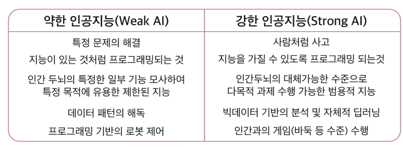
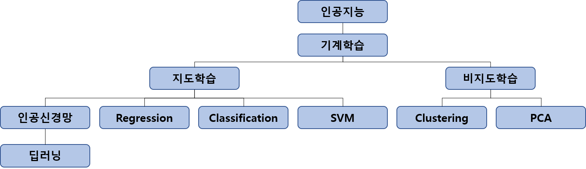
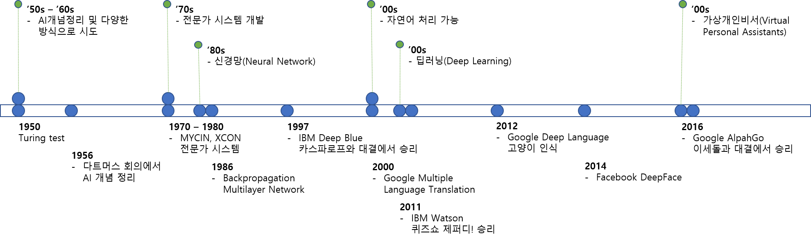
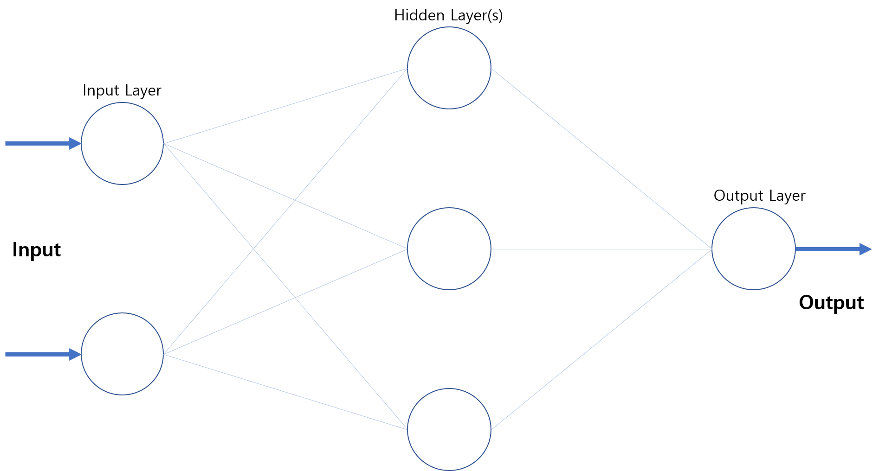
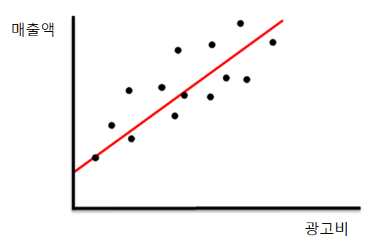
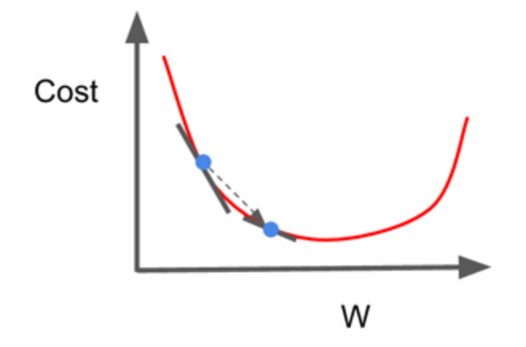
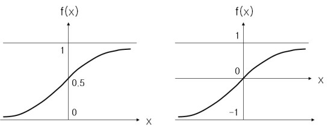
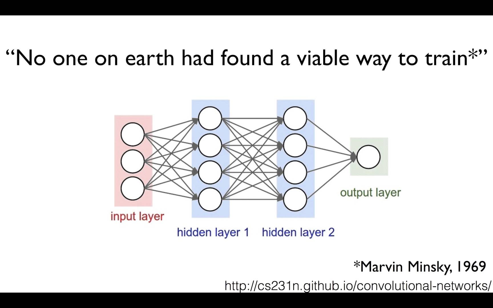

.. _Rest1:

************************************
Rest1. [쉬어가기] 약인공지능의 발전과 딥러닝 알고리즘
************************************

이 문서는 MicroSoftWare VOL.391에 나온 ``약인공지능의 발전과 딥러닝 알고리듬`` 을 요약/정리한 것이다.

:Authors:
    `Woong Jeong <https://github.com/scarleaf>`_

.. _01 강인공지능과 약인공지능:

01 강인공지능과 약인공지능
========================

.. _02 인공지능 알고리즘의 변천과정:

02 인공지능 알고리즘의 변천과정
========================

.. _03 회귀분석(Regression):

03 회귀분석(Regression)
========================

.. image:: imgs/rest_fig6.png
	:width: 400px
	:align: center
	:height: 100px
	:alt: alternate text

.. _04 이진 분류(Binary Classification):

04 이진 분류(Binary Classification)
========================

.. _05 딥러닝의 등장:

05 딥러닝의 등장
========================

.. image:: imgs/rest_fig9.png
	:width: 400px
	:align: center
	:height: 100px
	:alt: alternate text

	.. image:: imgs/rest_fig11.jpg
		:width: 400px
		:align: center
		:height: 100px
		:alt: alternate text
